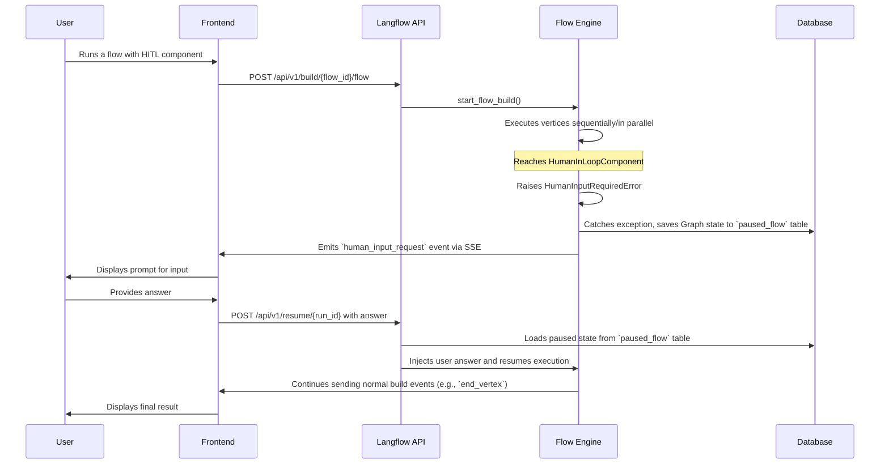
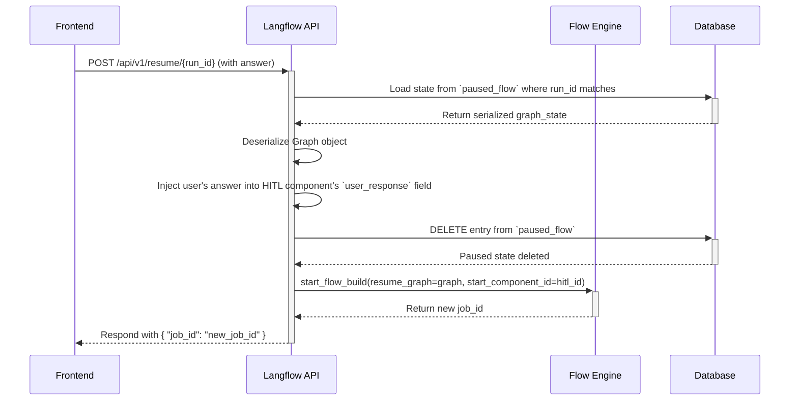

## High-Level Design (HLD)

### 1. Overview

The core architectural change is to introduce a stateful, pausable execution model built upon the existing asynchronous, event-driven flow processing system.

### 2. System Architecture & Components

The implementation will introduce or modify the following key components:

1.  **HumanInLoop Component:** A new UI component that users can add to their flows. Its execution triggers the pause mechanism.
2.  **Flow Execution Engine (`api/build.py`):** The existing engine will be enhanced to handle a new "pause" state. It will be responsible for catching the HITL signal, persisting the flow's state, and notifying the frontend.
3.  **Persistence Layer (Database):** A new database table, `paused_flow`, will be introduced to store the serialized state of paused flows, ensuring that the state is not lost if the user disconnects or the server restarts.
4.  **API Layer:**
    *   The existing build endpoint (`/api/v1/build/{flow_id}/flow`) will be used to initiate flows.
    *   The existing events endpoint (`/api/v1/build/{job_id}/events`) will be used to stream a new `human_input_request` event.
    *   A new **Resume API Endpoint** (`/api/v1/resume/{run_id}`) will be created to accept user input and trigger the resumption of a paused flow.
5.  **Frontend (UI):** The frontend will need to be updated to handle the `human_input_request` event by displaying a prompt to the user and then calling the Resume API with the user's response. (Note: This document focuses on the backend implementation).

### 3. High-Level Flow Diagram



### 4. Data Models

A new database table is required to persist the state of paused flows.

**`paused_flow` Table:**
*   **`run_id` (Primary Key):** The unique identifier for a specific flow execution that has been paused.
*   **`graph_state` (JSON):** A complete snapshot of the `Graph` object at the moment of pause. This includes all vertex states, results, and the execution manager's state.
*   **`hitl_component_id` (String):** The ID of the component that triggered the pause.
*   **`question` (Text):** The question to be presented to the user.
*   **`user_id` (UUID):** Foreign key linking to the user who initiated the flow.
*   **`created_at` (DateTime):** Timestamp for when the flow was paused.

### 5. API Endpoints

*   **`POST /api/v1/build/{flow_id}/flow`** (Existing, Modified Behavior):
    *   Initiates a flow. No change in its signature.
    *   The underlying execution engine will now have the capability to pause and store state if a `HumanInLoopComponent` is encountered.

*   **`GET /api/v1/build/{job_id}/events`** (Existing, Modified Behavior):
    *   Streams execution events.
    *   Will now stream a new event type: `human_input_request`, which signals the frontend to prompt the user.

*   **`POST /api/v1/resume/{run_id}`** (New):
    *   **Purpose:** To resume a paused flow.
    *   **Request Body:** `{ "answer": "user's response" }`
    *   **Functionality:** Retrieves the saved state from the database, injects the user's answer, and re-queues the flow for execution from the point it was paused.

### 6. Key Design Decisions

*   **Persistence over Caching:** Using a dedicated database table (`paused_flow`) instead of the existing cache service (`ChatService`) is crucial for persistence. A user might take minutes or hours to respond, and the flow state must survive server restarts or cache evictions.
*   **Exception-Driven Pausing:** Using a custom exception (`HumanInputRequiredError`) to signal a pause is a clean and effective way to interrupt the execution flow without cluttering the main execution loop with conditional checks. This centralizes the pause-and-save logic in the exception handler.
*   **Leveraging the Existing Build System:** The asynchronous, queue-based build system is the ideal foundation. Resuming a flow simply involves re-hydrating the graph and starting a new build job with the restored state, minimizing changes to the core execution logic.

---

## Low-Level Design (LLD)

### 1. Detailed Database Schema

**File:** `langflow/services/database/models/paused_flow/model.py`

```python
from datetime import datetime, timezone
from uuid import UUID, uuid4

from sqlmodel import JSON, Column, Field, SQLModel

class PausedFlow(SQLModel, table=True):
    id: UUID = Field(default_factory=uuid4, primary_key=True)
    run_id: str = Field(index=True, unique=True, nullable=False)
    flow_id: UUID = Field(foreign_key="flow.id", nullable=False)
    user_id: UUID = Field(foreign_key="user.id", nullable=False)
    graph_state: dict = Field(sa_column=Column(JSON), nullable=False)
    hitl_component_id: str = Field(nullable=False)
    question: str = Field(nullable=False)
    created_at: datetime = Field(default_factory=lambda: datetime.now(timezone.utc))
```

An Alembic migration will be created in `alembic/versions/` to add this table.
- Present in `src/backend/base/langflow/alembic/versions/abcdefghikjo_add_paused_flow_table.py`


### 2. Component-Level Design

#### 2.1. `HumanInputRequiredError` Exception

**File:** `langflow/components/logic/human_in_the_loop.py`

```python
class HumanInputRequiredError(Exception):
    """Custom exception to signal that human input is required."""
    def __init__(self, question: str, component_id: str):
        self.question = question
        self.component_id = component_id
        super().__init__(f"Human input required for component {component_id}: {question}")
```

#### 2.2. `HumanInLoopComponent`

**File:** `langflow/components/logic/human_in_the_loop.py`

```python
from langflow.custom import Component
from langflow.io import MessageTextInput, HandleInput, Output
from langflow.schema.message import Message

class HumanInLoopComponent(Component):
    display_name = "Human In The Loop"

    inputs = [
        MessageTextInput(name="question", ...),
        HandleInput(name="input_value", ...),
        MessageTextInput(name="user_response", show=False, ...)
    ]

    outputs = [
        Output(name="response", method="get_response", ...),
        Output(name="original_input", method="pass_through_input", ...),
    ]

    def build(self) -> None:
        # The `user_response` field is initially None.
        # When the flow is resumed, the resume endpoint will populate this field.
        if self.user_response is None:
            raise HumanInputRequiredError(question=self.question, component_id=self._id)
        # If user_response is present, the flow continues, and output methods will be called.

    def get_response(self) -> Message:
        """Returns the user's response after the flow is resumed."""
        return Message(text=self.user_response)

    def pass_through_input(self) -> Message:
        """Passes the original input value through."""
        return self.input_value
```

### 3. API Endpoint Specifications

#### 3.1. `POST /api/v1/resume/{run_id}`

*   **Description:** Resumes a paused flow execution using the provided user answer.
*   **Path Parameter:**
    *   `run_id` (string, required): The ID of the paused flow run.
*   **Request Body:**
    ```json
    {
      "answer": "The user's response to the question."
    }
    ```
*   **Response Body (Success):**
    *   **Status Code:** `200 OK`
    *   **Content:**
        ```json
        {
          "job_id": "new_job_id_for_resumed_flow"
        }
        ```
*   **Response Body (Error):**
    *   **Status Code:** `404 Not Found` - If `run_id` does not correspond to a paused flow.
    *   **Status Code:** `401 Unauthorized` - If the user is not authenticated.
*   **Example `curl`:**
    ```bash
    curl -X POST "http://localhost:7860/api/v1/resume/some-run-id" \
    -H "Content-Type: application/json" \
    -H "x-api-key: YOUR_API_KEY" \
    -d '{"answer": "Yes, proceed with the operation."}'
    ```

### 4. Sequence Diagrams

#### 4.1. Pausing Sequence

```mermaid
sequenceDiagram
    participant FE as Frontend
    participant API as Langflow API
    participant Engine as Flow Engine
    participant DB as Database

    FE->>+API: POST /api/v1/build/{flow_id}/flow
    API->>+Engine: generate_flow_events(...)
    loop For each vertex
        Engine->>Engine: _build_vertex(...)
        alt Vertex is HumanInLoopComponent and needs input
            Engine-->>Engine: raise HumanInputRequiredError(question, component_id)
            break
        end
    end
    Note over Engine: Catch HumanInputRequiredError
    Engine->>+DB: Serialize Graph state and save to `paused_flow` table
    DB-->>-Engine: State saved
    Engine->>-FE: Emit `human_input_request` event (question, run_id)
```

#### 4.2. Resuming Sequence



### 5. Code-Level Implementation Details

*   **`langflow/api/build.py` (`_build_vertex` function):**
    *   Wrap the call to `vertex.build()` in a `try...except HumanInputRequiredError` block.
    *   In the `except` block:
        1.  Call `graph.dumps()` to get a serializable representation of the current graph state.
        2.  Use an `async with session_scope()` block to create a `PausedFlow` record and commit it to the database.
        3.  Call `event_manager.on_human_input_request(...)` to notify the frontend.
        4.  Use `return` to gracefully exit the `build_vertices` coroutine, stopping the current execution.

*   **`langflow/api/v1/resume.py` (New File):**
    *   Create a new FastAPI `APIRouter`.
    *   Define the `POST /{run_id}` endpoint.
    *   Implement the logic described in the sequence diagram: load from DB, deserialize, update vertex, delete old state, and call `start_flow_build`.

*   **`langflow/api/build.py` (`start_flow_build` function):**
    *   Add optional parameters: `resume_graph: Graph | None = None`, `is_resume: bool = False`.
    *   Inside the function, add a conditional check:
        ```python
        if is_resume and resume_graph:
            graph = resume_graph
            # The sorting and preparation is already done,
            # we just need to set the queue to start from the HITL component.
            # This part needs careful implementation to ensure the run_manager
            # and queues are correctly initialized.
        else:
            # Existing logic to build graph from scratch
        ```